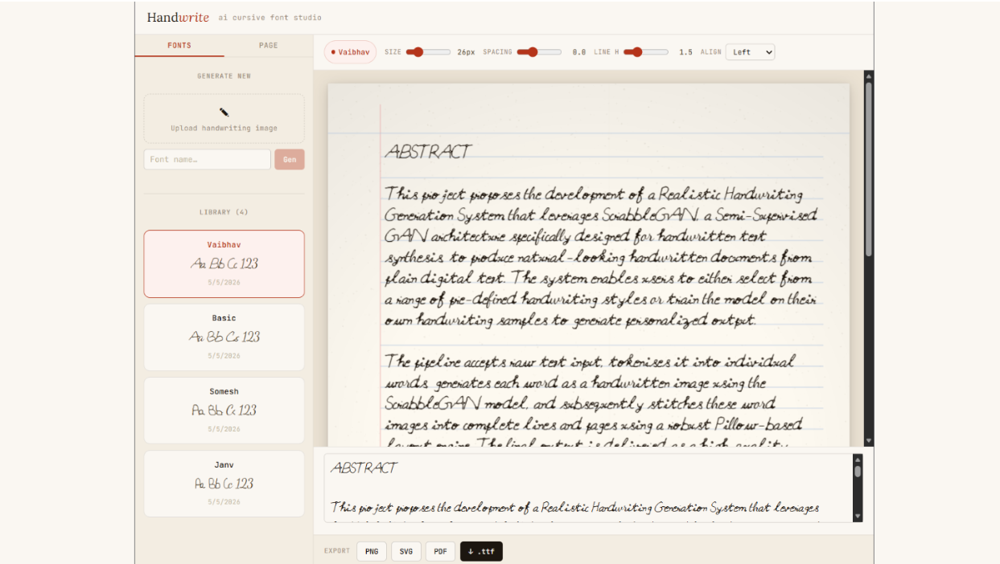
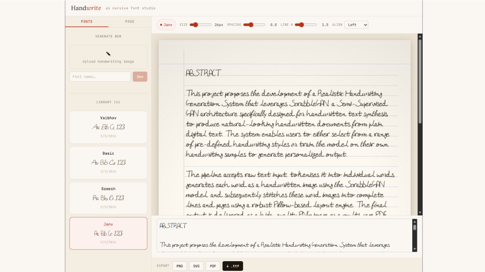
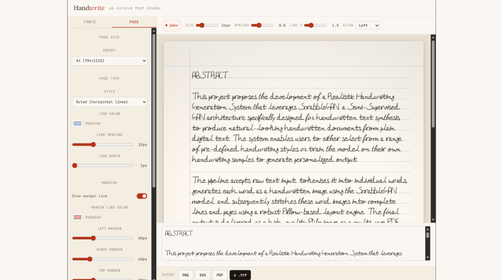
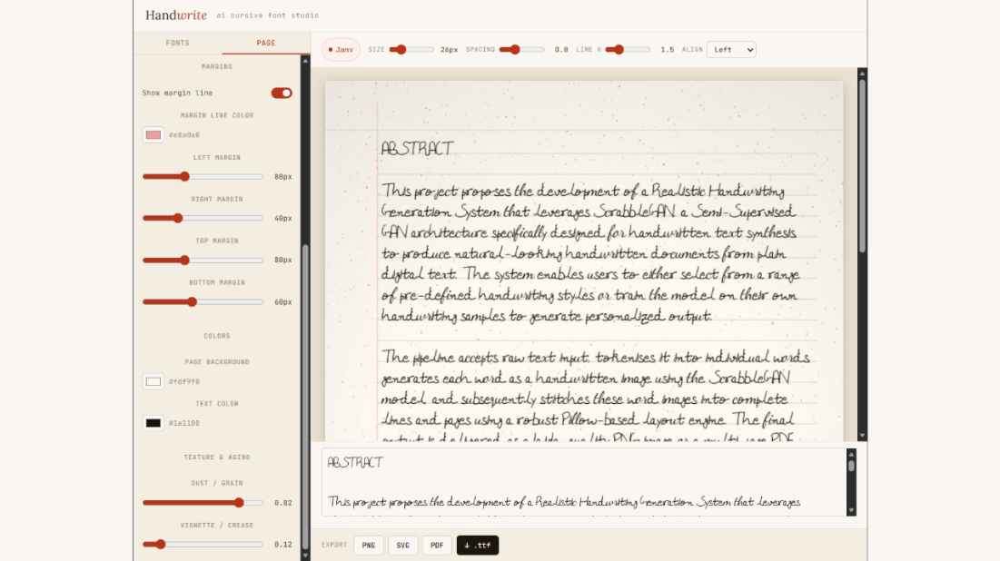

# InkFlow

InkFlow is a deep learning-based web application that converts handwritten characters into custom TrueType Font (.ttf) files. The system combines computer vision, OCR, deep learning, and font-generation techniques to transform handwritten samples into usable digital fonts.

---

## Overview

InkFlow automates the process of creating personalized fonts from handwriting. Users upload handwritten character samples through a web interface, and the backend processes the input through segmentation, classification, and font-generation pipelines to produce a downloadable font file.

---

## Features

- Upload handwritten character samples
- Automatic character segmentation
- Character recognition using deep learning
- Font glyph generation
- Export custom fonts in `.ttf` format
- Interactive and responsive web interface

---

## Tech Stack

### Frontend
- React.js
- Vite
- JavaScript
- HTML5
- CSS3

### Backend
- Python
- Flask
- PyTorch
- PaddleOCR
- OpenCV
- FontTools

### Computer Vision & Deep Learning
- Character Segmentation
- Character Classification
- OCR-based preprocessing
- Font Glyph Generation

---

## System Architecture

```text
User Upload
      │
      ▼
Frontend (React + Vite)
      │
      ▼
Backend API (Flask)
      │
      ├── Character Segmentation
      │
      ├── Character Classification
      │
      └── Font Creation
              │
              ▼
        Generated .ttf File
```

---

## Project Structure

```text
InkFlow/
│
├── backend/
│   ├── character_classification.py
│   ├── character_segmentation.py
│   ├── font_creation.py
│   ├── main.py
│   ├── server.py
│   ├── requirements.txt
│   ├── resources/
│   └── examples/
│
├── frontend/
│   ├── public/
│   ├── src/
│   ├── package.json
│   ├── vite.config.js
│   └── index.html
│
├── README.md
└── LICENSE
```

---

## Backend Pipeline

### 1. Character Segmentation
Extracts individual handwritten characters from uploaded images using computer vision techniques.

### 2. Character Classification
Identifies segmented characters using deep learning models and OCR-assisted processing.

### 3. Font Generation
Converts classified characters into vectorized glyphs and generates a TrueType Font (.ttf) file using FontTools.

---

## Installation

### Clone Repository

```bash
git clone https://github.com/<username>/InkFlow.git
cd InkFlow
```

---

### Backend Setup

```bash
cd backend
pip install -r requirements.txt
```

Run the backend server:

```bash
python server.py
```

---

### Frontend Setup

```bash
cd frontend
npm install
npm run dev
```

The frontend will typically run at:

```text
http://localhost:5173
```

---

## Workflow

1. User uploads handwriting samples.
2. Images are sent to the backend.
3. Characters are segmented.
4. Segmented characters are classified.
5. Glyphs are generated from recognized characters.
6. A custom `.ttf` font file is created.
7. User downloads the generated font.

---

## Screenshots

### Handwriting 1 Demo



### Handwriting 2 Demo



### Edit Preview 1



### Dust/Grain Functionality Preview



---

## Contributors

Developed as a collaborative team project.

Contributions included:
- Frontend development using React and Vite
- Character segmentation and classification pipeline
- Deep learning integration
- Font generation workflow
- Backend API development

---

## Future Improvements

- Support for multiple handwriting styles
- Real-time font preview
- User accounts and cloud storage
- Improved character recognition accuracy
- Expanded language support

---
